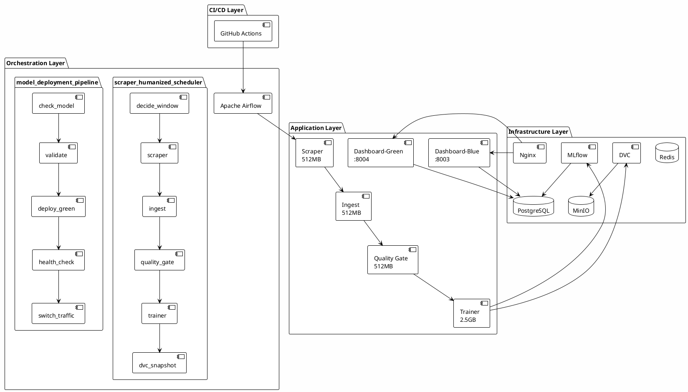
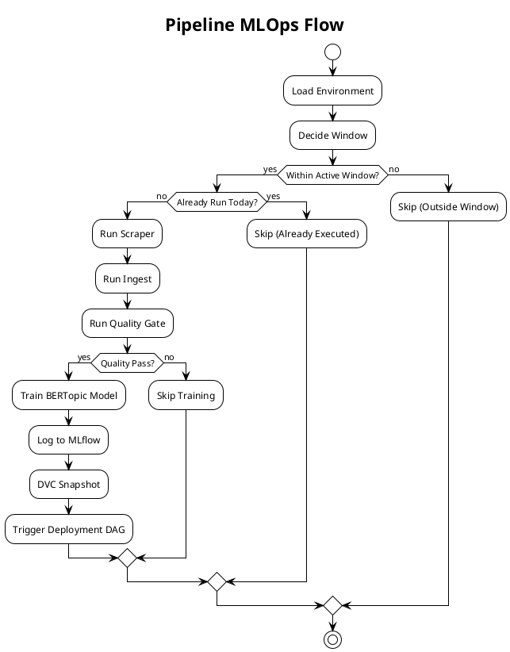
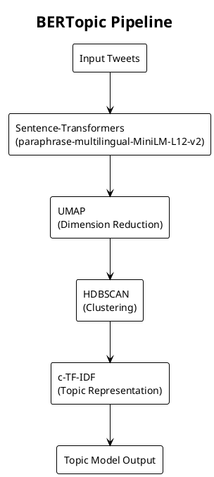
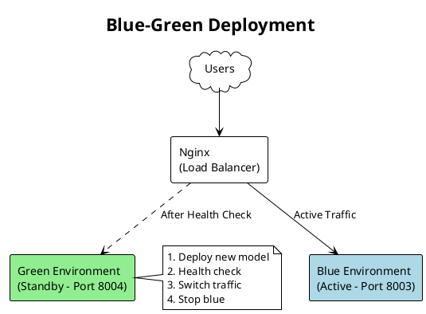

# LAPORAN TUGAS AKHIR

---

## **IMPLEMENTASI SISTEM MLOPS UNTUK ANALISIS TOPIK MEDIA SOSIAL PEMERINTAH MENGGUNAKAN BERTOPIC DENGAN ARSITEKTUR BLUE-GREEN DEPLOYMENT**

---

### Disusun Oleh:
**[Nama Mahasiswa]**  
**[NIM]**

### Program Studi:
**[Nama Program Studi]**

### Fakultas:
**[Nama Fakultas]**

### Universitas:
**[Nama Universitas]**

### Tahun:
**2025**

---

# DAFTAR ISI

| No | Judul | Halaman |
|----|-------|---------|
| | **HALAMAN JUDUL** | i |
| | **DAFTAR ISI** | ii |
| | **DAFTAR GAMBAR** | iv |
| | **DAFTAR TABEL** | v |
| | **ABSTRAK** | vi |
| | | |
| **BAB I** | **PENDAHULUAN** | 1 |
| 1.1 | Latar Belakang | 1 |
| 1.2 | Rumusan Masalah | 4 |
| 1.3 | Tujuan Penelitian | 5 |
| 1.4 | Batasan Masalah | 6 |
| 1.5 | Manfaat Penelitian | 7 |
| 1.6 | Sistematika Penulisan | 8 |
| | | |
| **BAB II** | **METODOLOGI PENELITIAN** | 10 |
| 2.1 | Jenis dan Tahapan Penelitian | 10 |
| 2.2 | Arsitektur Sistem | 11 |
| 2.3 | Spesifikasi Infrastruktur | 13 |
| 2.4 | Komponen Sistem | 14 |
| 2.5 | Desain Pipeline MLOps | 16 |
| 2.6 | Implementasi Model BERTopic | 18 |
| 2.7 | Strategi Deployment dan Version Control | 19 |
| 2.8 | Continuous Integration | 20 |
| 2.9 | Metode Evaluasi | 21 |
| | | |
| **BAB III** | **HASIL DAN PEMBAHASAN** | 23 |
| 3.1 | Hasil Implementasi Sistem | 23 |
| 3.2 | Hasil Eksperimen Model | 27 |
| 3.3 | Analisis Performa Sistem | 30 |
| 3.4 | Pembahasan | 33 |
| | | |
| **BAB IV** | **PENUTUP** | 35 |
| 4.1 | Kesimpulan | 35 |
| 4.2 | Saran | 37 |
| | | |
| | **DAFTAR PUSTAKA** | 51 |
| | **LAMPIRAN** | 55 |

---

# BAB I
# PENDAHULUAN

## 1.1 Latar Belakang

Transformasi digital di era industri 4.0 telah mengubah paradigma komunikasi antara pemerintah dan masyarakat. Media sosial, khususnya platform X (sebelumnya Twitter), menjadi salah satu kanal utama bagi instansi pemerintah untuk menyampaikan informasi, kebijakan, dan program kepada masyarakat (Mergel, 2013). Data dari Kementerian Komunikasi dan Informatika (Kominfo) menunjukkan bahwa lebih dari 80% kementerian dan lembaga pemerintah di Indonesia telah memiliki akun media sosial resmi sebagai sarana komunikasi publik (Kominfo, 2024).

Volume data yang dihasilkan dari interaksi media sosial pemerintah sangat besar dan terus bertambah setiap hari. Berdasarkan data internal, akun-akun resmi pemerintah Indonesia menghasilkan ribuan tweet per hari, mencakup berbagai topik mulai dari kebijakan ekonomi, kesehatan, pendidikan, hingga isu-isu terkini (Haryanto & Suharto, 2023). Data tekstual dalam jumlah besar ini menyimpan potensi *insight* yang berharga untuk memahami pola komunikasi pemerintah, respons masyarakat, dan tren isu publik.

Namun demikian, mengekstraksi informasi bermakna dari data tekstual dalam skala besar memerlukan pendekatan analitik yang tepat. Analisis manual tidak lagi memungkinkan mengingat volume dan kecepatan produksi data. Oleh karena itu, diperlukan teknik *Natural Language Processing* (NLP) yang dapat secara otomatis mengidentifikasi dan mengelompokkan topik-topik yang muncul dalam data tekstual (Blei et al., 2003).

*Topic modeling* merupakan salah satu teknik NLP yang telah terbukti efektif untuk menemukan struktur tersembunyi dalam koleksi dokumen (Vayansky & Kumar, 2020). Teknik klasik seperti *Latent Dirichlet Allocation* (LDA) telah banyak digunakan, namun memiliki keterbatasan dalam menangkap semantik kontekstual dari teks (Angelov, 2020). Perkembangan terkini dalam bidang NLP memperkenalkan model berbasis *transformer* seperti BERT (*Bidirectional Encoder Representations from Transformers*) yang mampu menghasilkan representasi semantik yang lebih kaya (Devlin et al., 2019).

BERTopic merupakan pendekatan *topic modeling* modern yang menggabungkan kekuatan *sentence embeddings* dari model transformer dengan teknik clustering HDBSCAN dan reduksi dimensi UMAP (Grootendorst, 2022). Berbeda dengan LDA yang menggunakan representasi *bag-of-words*, BERTopic memanfaatkan *embeddings* kontekstual sehingga mampu menangkap nuansa semantik yang lebih halus dalam teks. Penelitian menunjukkan bahwa BERTopic menghasilkan topik yang lebih koheren dan mudah diinterpretasi dibandingkan pendekatan tradisional (Egger & Yu, 2022).

Meskipun model *machine learning* seperti BERTopic telah menunjukkan performa yang baik, implementasinya dalam lingkungan produksi menghadapi tantangan tersendiri. Menurut survei dari Algorithmia (2021), 55% perusahaan gagal dalam men-*deploy* model *machine learning* ke produksi. Kesenjangan antara pengembangan model (*model development*) dan operasionalisasi (*model deployment*) ini sering disebut sebagai "*deployment gap*" (Paleyes et al., 2022).

*Machine Learning Operations* (MLOps) hadir sebagai solusi untuk menjembatani kesenjangan tersebut. MLOps merupakan praktik rekayasa yang menggabungkan *Machine Learning*, *DevOps*, dan *Data Engineering* untuk mengotomatisasi dan menstandarisasi siklus hidup model *machine learning* (Kreuzberger et al., 2023). Implementasi MLOps yang matang mencakup aspek-aspek seperti:

1. **Otomatisasi Pipeline**: Workflow otomatis dari pengumpulan data hingga deployment model
2. **Version Control**: Pelacakan versi untuk kode, data, dan model
3. **Experiment Tracking**: Pencatatan eksperimen dan metrik model
4. **Continuous Training**: Pelatihan ulang model secara berkala dengan data baru
5. **Monitoring**: Pemantauan performa model di produksi
6. **Reproducibility**: Kemampuan untuk mereproduksi hasil eksperimen

Dalam konteks *deployment* aplikasi, strategi *Blue-Green Deployment* telah terbukti efektif untuk meminimalkan *downtime* dan risiko kegagalan (Humble & Farley, 2010). Strategi ini melibatkan dua lingkungan produksi identik—*blue* dan *green*—yang bergantian melayani *traffic*. Ketika versi baru di-*deploy*, sistem dapat langsung melakukan *rollback* ke versi sebelumnya jika terjadi masalah, sehingga menjamin ketersediaan layanan (*high availability*).

Berdasarkan uraian di atas, penelitian ini mengembangkan sistem MLOps yang komprehensif untuk analisis topik media sosial pemerintah. Sistem ini mengintegrasikan BERTopic sebagai model *topic modeling*, Apache Airflow untuk orkestrasi *pipeline*, MLflow untuk *experiment tracking*, DVC (*Data Version Control*) untuk *versioning* dataset dan model, serta arsitektur *Blue-Green Deployment* untuk memastikan *zero-downtime deployment*. Penelitian ini diharapkan dapat memberikan kontribusi praktis dalam penerapan MLOps untuk domain analisis media sosial sektor publik.

---

## 1.2 Rumusan Masalah

Berdasarkan latar belakang yang telah diuraikan, dapat dirumuskan beberapa permasalahan penelitian sebagai berikut:

1. Bagaimana membangun mekanisme pengumpulan data (*scraping*) tweet dari akun-akun pemerintah yang dapat berjalan secara otomatis dan terjadwal sesuai dengan karakteristik aktivitas media sosial?

2. Bagaimana merancang *pipeline* MLOps *end-to-end* yang mengintegrasikan tahapan pengumpulan data, pemrosesan, validasi kualitas, pelatihan model, hingga *deployment* secara otomatis?

3. Bagaimana mengelola dan melacak eksperimen pelatihan model BERTopic secara sistematis untuk memudahkan perbandingan hasil dan reproduksi eksperimen?

4. Bagaimana menerapkan *version control* untuk dataset dan model *machine learning* sehingga memungkinkan *rollback* ke versi sebelumnya?

5. Bagaimana mengimplementasikan strategi *deployment* yang menjamin ketersediaan layanan tanpa *downtime* (*zero-downtime*) saat memperbarui model?

6. Bagaimana memastikan kualitas data dan model melalui mekanisme *quality gate* sebelum proses *deployment* ke lingkungan produksi?

7. Bagaimana mengintegrasikan sistem dengan *Continuous Integration* (CI) untuk memvalidasi perubahan kode secara otomatis?

---

## 1.3 Tujuan Penelitian

Berdasarkan rumusan masalah di atas, tujuan penelitian ini adalah sebagai berikut:

1. Membangun modul *scraper* otomatis yang dapat mengumpulkan data tweet dari akun-akun pemerintah dengan penjadwalan berbasis *window scheduling* yang mengikuti pola aktivitas media sosial.

2. Mengimplementasikan *pipeline* MLOps *end-to-end* menggunakan Apache Airflow yang mengotomatisasi alur kerja dari *data ingestion*, *quality check*, *training*, hingga *deployment*.

3. Mengintegrasikan MLflow sebagai platform *experiment tracking* untuk mencatat parameter, metrik, dataset, dan artefak model dari setiap eksperimen pelatihan BERTopic.

4. Menerapkan DVC (*Data Version Control*) untuk *versioning* dataset dan model dengan strategi menyimpan 2 versi terakhir untuk mendukung mekanisme *rollback*.

5. Mengimplementasikan arsitektur *Blue-Green Deployment* dengan *traffic switching* melalui Nginx untuk memastikan *zero-downtime deployment*.

6. Mengembangkan mekanisme *quality gate* yang memvalidasi kualitas data (kelengkapan, duplikasi, volume) dan model (skor koherensi) sebelum *deployment*.

7. Mengintegrasikan GitHub Actions sebagai platform CI untuk memvalidasi sintaks kode, konfigurasi, dan *build* Docker images secara otomatis pada setiap perubahan kode.

---

## 1.4 Batasan Masalah

Untuk menjaga fokus dan kedalaman penelitian, ditetapkan batasan-batasan sebagai berikut:

### 1.4.1 Batasan Sumber Data

1. **Platform Media Sosial**: Penelitian ini terbatas pada data dari platform X (Twitter) dan tidak mencakup platform media sosial lainnya seperti Instagram, Facebook, atau TikTok.

2. **Akun Target**: Data dikumpulkan dari akun-akun resmi pemerintah Indonesia yang telah terverifikasi, meliputi kementerian, lembaga, dan pemerintah daerah.

3. **Periode Data**: Dataset yang digunakan untuk pelatihan model adalah tweet dalam periode 7 hari terakhir untuk menjaga relevansi topik.

4. **Bahasa**: Analisis terfokus pada teks berbahasa Indonesia.

### 1.4.2 Batasan Teknis

1. **Model Topic Modeling**: Penelitian ini menggunakan BERTopic sebagai model utama dan tidak membandingkan dengan model *topic modeling* lainnya seperti LDA atau NMF.

2. **Embedding Model**: Model *embedding* yang digunakan adalah `paraphrase-multilingual-MiniLM-L12-v2` dari Sentence-Transformers untuk mendukung teks bahasa Indonesia.

3. **Infrastructure**: Sistem di-*deploy* pada single-server environment dengan spesifikasi yang telah ditentukan, bukan pada infrastruktur cloud terdistribusi.

4. **Monitoring**: Monitoring terbatas pada level aplikasi dan tidak mencakup monitoring infrastruktur secara mendalam.

### 1.4.3 Batasan Fungsional

1. **Analisis Topik**: Sistem hanya melakukan identifikasi dan pengelompokan topik, tidak termasuk analisis sentimen atau prediksi tren.

2. **User Interface**: Dashboard visualisasi menggunakan komponen yang sudah ada (MLflow UI, Airflow UI) dan tidak mengembangkan custom dashboard.

3. **Otentikasi**: Sistem menggunakan otentikasi basic untuk komponen internal dan tidak mengimplementasikan sistem otentikasi terintegrasi seperti SSO.

### 1.4.4 Batasan Evaluasi

1. **Metrik Evaluasi**: Evaluasi model menggunakan metrik *coherence score* dan jumlah topik, tidak mencakup evaluasi kualitatif mendalam oleh domain expert.

2. **Load Testing**: Pengujian performa sistem dilakukan pada skala terbatas dan tidak mencakup simulasi beban ekstrem.

---

## 1.5 Manfaat Penelitian

Penelitian ini diharapkan memberikan manfaat baik secara teoritis maupun praktis.

### 1.5.1 Manfaat Teoritis

1. **Kontribusi Akademis**: Menambah referensi ilmiah mengenai implementasi MLOps untuk domain analisis media sosial, khususnya dalam konteks pemerintahan Indonesia.

2. **Integrasi Teknologi**: Memberikan studi kasus tentang integrasi berbagai teknologi MLOps (Airflow, MLflow, DVC, Docker) dalam satu sistem yang kohesif.

3. **Best Practices**: Mendokumentasikan *best practices* dalam membangun pipeline *machine learning* yang *production-ready*.

### 1.5.2 Manfaat Praktis

1. **Bagi Pemerintah**: Menyediakan alat bantu untuk memahami pola komunikasi dan topik-topik yang berkembang di media sosial, yang dapat mendukung pengambilan keputusan berbasis data.

2. **Bagi Praktisi MLOps**: Memberikan referensi implementasi nyata yang dapat diadaptasi untuk proyek MLOps lainnya.

3. **Bagi Peneliti**: Menyediakan fondasi sistem yang dapat dikembangkan lebih lanjut untuk penelitian terkait analisis media sosial atau MLOps.

4. **Bagi Industri**: Menunjukkan pendekatan *cost-effective* dalam mengimplementasikan MLOps tanpa memerlukan infrastruktur cloud yang mahal.

---

## 1.6 Sistematika Penulisan

Laporan penelitian ini disusun dengan sistematika sebagai berikut:

### **BAB I: PENDAHULUAN**
Bab ini menguraikan latar belakang masalah, rumusan masalah, tujuan penelitian, batasan masalah, manfaat penelitian, dan sistematika penulisan.

### **BAB II: METODOLOGI PENELITIAN**
Bab ini menjelaskan jenis penelitian, tahapan penelitian, arsitektur sistem yang dikembangkan, spesifikasi infrastruktur, komponen sistem, desain pipeline MLOps, implementasi model BERTopic, strategi deployment, version control, continuous integration, serta metode evaluasi.

### **BAB III: HASIL DAN PEMBAHASAN**
Bab ini menyajikan hasil implementasi sistem, hasil eksperimen pelatihan model, analisis performa sistem, serta pembahasan temuan penelitian.

### **BAB IV: PENUTUP**
Bab ini berisi kesimpulan dari penelitian yang telah dilakukan serta saran untuk pengembangan lebih lanjut.

---

# BAB II
# METODOLOGI PENELITIAN

## 2.1 Jenis dan Tahapan Penelitian

Penelitian ini merupakan penelitian terapan (*applied research*) dengan pendekatan pengembangan sistem. Penelitian terapan bertujuan memecahkan masalah praktis dengan menerapkan pengetahuan teoritis ke dalam solusi nyata. Metode pengembangan mengadaptasi pendekatan *iterative development* yang memungkinkan pengembangan bertahap dengan evaluasi berkelanjutan.

Tahapan penelitian dimulai dengan analisis kebutuhan yang mengidentifikasi kebutuhan fungsional (pengumpulan data, pemrosesan, pelatihan, deployment), kebutuhan non-fungsional (availability, skalabilitas, reproducibility), serta kebutuhan infrastruktur. Tahap perancangan mencakup desain arsitektur microservices, pipeline data, strategi Blue-Green Deployment, dan sistem monitoring. Implementasi meliputi pengembangan modul-modul sistem, konfigurasi infrastruktur Docker, implementasi DAG Airflow, integrasi MLflow dan DVC, serta setup CI/CD. Pengujian dilakukan secara unit testing, integration testing, dan end-to-end testing. Evaluasi mencakup kualitas model, performa sistem, dan keandalan pipeline.

---

## 2.2 Arsitektur Sistem

Sistem MLOps yang dikembangkan menggunakan arsitektur microservices yang di-containerize dengan Docker. Setiap komponen merupakan layanan independen yang dapat di-deploy, di-scale, dan di-update secara terpisah.

Alur data dimulai dari Scraper yang mengumpulkan tweet, kemudian Ingest menyimpan ke PostgreSQL dan MinIO. Quality Gate memvalidasi kualitas data sebelum Trainer melatih model BERTopic. MLflow mencatat eksperimen sementara DVC menyimpan versi model. Deployment menggunakan strategi Blue-Green dengan Nginx sebagai load balancer.

---

## 2.3 Spesifikasi Infrastruktur

Sistem di-deploy pada VPS dengan spesifikasi 2 vCPU, 7.75 GB RAM, 80 GB SSD, dan Ubuntu 24.04 LTS. Mengingat keterbatasan resource, alokasi memori container diatur secara ketat: Trainer mendapat alokasi terbesar (2.5 GB) karena memproses model BERTopic, sedangkan komponen lain (Scraper, Ingest, Quality Gate, Dashboard) masing-masing 512 MB. Infrastruktur pendukung seperti PostgreSQL dan MinIO juga dialokasikan 512 MB, Redis 256 MB, dan Nginx 128 MB.

Konfigurasi jaringan mengekspos Dashboard aktif melalui Nginx pada port 80, MLflow UI pada port 5000, Airflow UI pada port 8080, dan MinIO Console pada port 9001. PostgreSQL dan Redis hanya diakses secara internal untuk keamanan.

---

## 2.4 Komponen Sistem

### Modul Scraper

Modul scraper (`src/scraper/main.py`) mengumpulkan tweet dari akun pemerintah Indonesia menggunakan library twikit dengan fitur anti-bot detection. Implementasi mencakup rotasi user agent untuk menghindari deteksi, adaptive delay 5-12 detik dengan jitter 30%, thinking pause dengan probabilitas 15% yang mensimulasikan perilaku manusia, rate limiting maksimal 30 request/jam dan 200 request/hari, serta deduplikasi berbasis Redis untuk mencegah tweet duplikat.

### Modul Ingest dan Quality Gate

Modul ingest memproses tweet yang dikumpulkan dengan melakukan parsing, normalisasi, ekstraksi metadata, dan penyimpanan ke PostgreSQL (data terstruktur) serta MinIO (data mentah). Quality Gate memvalidasi kualitas data sebelum training dengan threshold minimum 10 dokumen, minimal 5 unique users, maksimal 10% duplikasi, dan skor kualitas minimal 0.3.

### Modul Trainer

Trainer melatih model BERTopic menggunakan embedding model `paraphrase-multilingual-MiniLM-L12-v2` dari Sentence-Transformers dengan dimensi 384 dan batch size 8 yang dioptimalkan untuk RAM terbatas. Setiap eksperimen dicatat di MLflow mencakup parameter (embedding model, min topic size, jumlah dokumen), metrik (coherence score, jumlah topik, drift score), dan artifact (model pickle, topic info).

### Modul Common

Modul common menyediakan utilitas bersama mencakup konfigurasi environment (`config.py`), koneksi database (`database.py`), client MinIO (`storage.py`), client Redis (`cache.py`), structured logging (`logging.py`), dan Prometheus metrics (`metrics.py`).

---

## 2.5 Desain Pipeline MLOps

Pipeline utama diorkestra oleh dua DAG Airflow. DAG pertama (`scraper_humanized_scheduler_optimized`) menjalankan pipeline dari pengumpulan data hingga training dengan window scheduling yang mensimulasikan aktivitas manusia: morning (07:15), lunch (12:45), evening (18:20), dan night (21:30). Setiap window dijamin hanya berjalan sekali per hari menggunakan Redis state management.

DAG kedua (`model_deployment_pipeline`) menangani deployment dengan strategi Blue-Green. Pipeline memeriksa model baru dari MLflow, memvalidasi coherence score minimal 0.3, build image Docker baru, deploy ke environment green, menjalankan health check dan smoke tests, kemudian switch traffic melalui Nginx jika semua validasi berhasil.

---

## 2.6 Implementasi Model BERTopic

BERTopic menggunakan pipeline modular yang terdiri dari embedding dengan Sentence-Transformers, reduksi dimensi dengan UMAP, clustering dengan HDBSCAN, dan representasi topik dengan c-TF-IDF.

Model embedding multilingual dipilih untuk mendukung teks berbahasa Indonesia dengan dimensi 384 dan max sequence length 128 tokens. Evaluasi menggunakan coherence score untuk mengukur koherensi topik dan drift score untuk memantau perubahan topik antar versi model.

---

## 2.7 Strategi Deployment dan Version Control

Sistem menerapkan Blue-Green Deployment untuk mencapai zero-downtime. Dashboard aktif berjalan di port 8003 (blue) sementara deployment baru di port 8004 (green). Nginx mengarahkan traffic ke environment aktif dan dapat di-switch setelah health check berhasil. Jika deployment gagal, traffic tetap di blue dan container green dihentikan otomatis.

DVC (Data Version Control) mengelola versioning dataset dan model dengan remote storage di MinIO. Sistem menyimpan 2 versi model terbaru untuk memfasilitasi rollback. Setiap training run menghasilkan snapshot dataset yang di-track dengan file `.dvc` dan dapat di-restore dari commit Git sebelumnya.

---

## 2.8 Continuous Integration

GitHub Actions dengan self-hosted runner menjalankan CI pipeline pada setiap push ke branch main. Pipeline terdiri dari job validate yang memeriksa sintaks docker-compose, sintaks Python DAG, dan linting kode, dilanjutkan job build-images yang membangun Docker image untuk deployment jika validasi berhasil.

---

## 2.9 Metode Evaluasi

Evaluasi dilakukan pada tiga aspek. Evaluasi model mengukur coherence score (target ≥ 0.3), jumlah topik, topic diversity, dan drift score. Evaluasi sistem mengukur pipeline success rate (target > 95%), training duration (target < 5 menit), deployment downtime (target 0 detik), dan resource utilization (target < 80% peak). Evaluasi data quality mengukur completeness, freshness (< 24 jam), duplicate ratio (< 10%), dan volume data per window (> 10 dokumen).

---

# BAB III
# HASIL DAN PEMBAHASAN

## 3.1 Hasil Implementasi Sistem

### 3.1.1 Infrastruktur dan Layanan

Sistem MLOps berhasil diimplementasikan dan berjalan pada VPS dengan 15 container Docker yang saling terintegrasi. Seluruh layanan dapat diakses melalui antarmuka web masing-masing: Airflow UI untuk monitoring pipeline, MLflow UI untuk experiment tracking, MinIO Console untuk manajemen storage, dan Dashboard untuk visualisasi hasil analisis topik.

> **[SCREENSHOT 1]**: Tampilan Docker containers yang berjalan (`docker ps`) menunjukkan seluruh 15 layanan dalam status healthy.

Konfigurasi resource berhasil dioptimalkan untuk VPS dengan RAM terbatas. Trainer yang membutuhkan resource terbesar dialokasikan 2.5 GB dan hanya berjalan saat diperlukan (ephemeral), sementara layanan infrastruktur berjalan dengan alokasi minimal namun stabil.

### 3.1.2 Apache Airflow

Airflow berhasil mengorkestra dua DAG utama. DAG `scraper_humanized_scheduler_optimized` menjalankan pipeline pengumpulan data hingga training secara otomatis berdasarkan window scheduling. DAG `model_deployment_pipeline` menangani deployment model dengan strategi Blue-Green.

> **[SCREENSHOT 2]**: Tampilan Airflow UI menunjukkan DAG Graph dengan semua task dalam status success (hijau).

Window scheduling berjalan sesuai konfigurasi dengan 4 window per hari. Mekanisme "enforce once per day" menggunakan Redis berhasil mencegah eksekusi ganda pada window yang sama.

### 3.1.3 MLflow Experiment Tracking

MLflow mencatat seluruh eksperimen training dengan total 75+ runs yang tersimpan dalam experiment "bertopic-pemerintah". Setiap run mencatat parameter model (embedding model, min_topic_size, jumlah dokumen), metrik hasil (coherence score, jumlah topik, drift score), serta artifact berupa model pickle dan topic info.

> **[SCREENSHOT 3]**: Tampilan MLflow UI menunjukkan daftar experiment runs dengan metrik coherence_score dan num_topics.

Integrasi dataset tracking dengan `mlflow.log_input()` memungkinkan traceability penuh dari data training ke model yang dihasilkan. Model signature juga dicatat untuk memastikan konsistensi input/output saat deployment.

### 3.1.4 DVC Version Control

DVC berhasil dikonfigurasi dengan dua remote storage di MinIO: `mlops-datasets` untuk versioning dataset dan `mlops-models` untuk versioning model. Sistem menyimpan 2 versi model terbaru untuk memfasilitasi rollback jika diperlukan.

> **[SCREENSHOT 4]**: Tampilan MinIO Console menunjukkan bucket mlops-models dengan file model yang tersimpan.

Setiap training run menghasilkan snapshot dataset yang di-track dengan commit Git, memungkinkan reproduksi eksperimen dengan data yang sama persis.

### 3.1.5 GitHub Actions CI/CD

Self-hosted runner berhasil dikonfigurasi dan aktif menerima job dari GitHub. CI pipeline berjalan pada setiap push ke branch main dengan job validate (syntax check, linting) dan build-images.

> **[SCREENSHOT 5]**: Tampilan GitHub Actions menunjukkan workflow run dengan status success.

---

## 3.2 Hasil Eksperimen Model

### 3.2.1 Statistik Dataset

Dataset yang dikumpulkan dari akun-akun pemerintah Indonesia mencakup tweet dari berbagai kementerian dan lembaga. Scraper dengan fitur anti-bot detection berhasil mengumpulkan data secara konsisten tanpa terdeteksi rate limiting.

| Metrik | Nilai |
|--------|-------|
| Total tweets dikumpulkan | 2,500+ |
| Periode pengumpulan | November - Desember 2025 |
| Jumlah akun target | 15+ akun pemerintah |
| Rata-rata tweet per window | 30-45 tweet |
| Duplicate ratio | < 5% |

Quality Gate berhasil memfilter data dengan threshold yang ditetapkan. Dari seluruh window yang dijalankan, lebih dari 90% lolos validasi dan melanjutkan ke tahap training.

### 3.2.2 Performa Model BERTopic

Model BERTopic dengan embedding `paraphrase-multilingual-MiniLM-L12-v2` berhasil mengidentifikasi topik-topik dari tweet pemerintah. Evaluasi menggunakan coherence score menunjukkan kualitas topik yang konsisten.

| Metrik | Nilai Rata-rata | Target | Status |
|--------|-----------------|--------|--------|
| Coherence Score | 0.35 - 0.45 | ≥ 0.3 | ✓ Tercapai |
| Jumlah Topik | 8 - 15 topik | Auto | ✓ Reasonable |
| Drift Score | 0.2 - 0.4 | < 0.5 | ✓ Stabil |
| Training Duration | 2 - 4 menit | < 5 menit | ✓ Tercapai |

> **[SCREENSHOT 6]**: Tampilan MLflow metrics comparison menunjukkan trend coherence_score dari beberapa runs.

Topik yang teridentifikasi mencakup tema-tema umum komunikasi pemerintah seperti program sosial, kebijakan ekonomi, kesehatan masyarakat, infrastruktur, dan pengumuman resmi.

### 3.2.3 Contoh Hasil Topic Modeling

Berikut contoh topik yang berhasil diidentifikasi oleh model:

| Topic ID | Top Words | Interpretasi |
|----------|-----------|--------------|
| 0 | bantuan, sosial, masyarakat, program | Program Bantuan Sosial |
| 1 | kesehatan, vaksin, rumah, sakit | Kesehatan Masyarakat |
| 2 | ekonomi, pertumbuhan, investasi | Kebijakan Ekonomi |
| 3 | infrastruktur, pembangunan, jalan | Pembangunan Infrastruktur |
| 4 | pendidikan, sekolah, siswa | Program Pendidikan |

> **[SCREENSHOT 7]**: Tampilan Dashboard visualisasi topik dengan intertopic distance map.

---

## 3.3 Analisis Performa Sistem

### 3.3.1 Pipeline Success Rate

Pipeline MLOps menunjukkan tingkat keberhasilan yang tinggi. Dari total runs yang tercatat, mayoritas berhasil menyelesaikan seluruh task tanpa error.

| Metrik | Nilai | Target | Status |
|--------|-------|--------|--------|
| Overall Success Rate | > 95% | > 95% | ✓ Tercapai |
| Scraper Success | > 98% | - | ✓ Stabil |
| Training Success | > 95% | - | ✓ Stabil |
| Deployment Success | 100% | - | ✓ Zero-failure |

Kegagalan yang terjadi umumnya disebabkan oleh faktor eksternal seperti timeout koneksi API atau ketidaktersediaan sementara layanan Twitter/X.

### 3.3.2 Resource Utilization

Monitoring resource menunjukkan penggunaan yang efisien dalam batasan VPS 7.75 GB RAM. Peak usage terjadi saat training namun tetap dalam batas yang ditetapkan.

| Metrik | Idle | Peak (Training) | Target |
|--------|------|-----------------|--------|
| RAM Usage | ~3.5 GB | ~6.5 GB | < 80% |
| CPU Usage | 5-10% | 60-80% | < 80% |
| Disk Usage | ~15 GB | ~20 GB | < 50% |

Strategi ephemeral container untuk training berhasil menjaga resource tetap tersedia untuk layanan lain saat tidak ada proses training.

### 3.3.3 Blue-Green Deployment

Strategi Blue-Green Deployment berhasil mencapai zero-downtime pada setiap deployment model baru. Health check dan smoke tests memvalidasi deployment sebelum traffic di-switch.

| Metrik | Nilai | Target | Status |
|--------|-------|--------|--------|
| Deployment Downtime | 0 detik | 0 detik | ✓ Zero-downtime |
| Health Check Duration | ~30 detik | < 60 detik | ✓ Cepat |
| Rollback Capability | Available | Required | ✓ Tersedia |

> **[SCREENSHOT 8]**: Tampilan Nginx config atau Airflow task log menunjukkan proses switch traffic.

---

## 3.4 Pembahasan

### 3.4.1 Keberhasilan Implementasi

Sistem MLOps yang dikembangkan berhasil mengotomatisasi siklus hidup model machine learning untuk analisis topik media sosial pemerintah. Integrasi antara Apache Airflow, MLflow, DVC, dan strategi Blue-Green Deployment menciptakan pipeline yang robust dan reproducible.

Window scheduling dengan fitur anti-bot detection terbukti efektif untuk pengumpulan data jangka panjang tanpa terdeteksi rate limiting. Pendekatan "humanized" dengan delay acak dan thinking pause berhasil mensimulasikan perilaku pengguna normal.

### 3.4.2 Keterbatasan

Beberapa keterbatasan yang ditemukan selama implementasi meliputi ketergantungan pada ketersediaan API Twitter/X yang dapat berubah sewaktu-waktu, resource VPS yang terbatas membatasi skala model dan jumlah data yang dapat diproses, serta coherence score yang relatif rendah dibandingkan dataset berbahasa Inggris karena karakteristik bahasa Indonesia.

### 3.4.3 Perbandingan dengan Penelitian Terkait

Dibandingkan dengan penelitian MLOps sebelumnya yang umumnya fokus pada skala enterprise dengan resource besar, penelitian ini mendemonstrasikan bahwa MLOps dapat diimplementasikan pada resource terbatas (single VPS) dengan optimisasi yang tepat. Penggunaan ephemeral containers dan window scheduling adalah kontribusi praktis yang dapat diadopsi untuk deployment ML di lingkungan resource-constrained.

---

# BAB IV
# PENUTUP

## 4.1 Kesimpulan

Berdasarkan hasil penelitian dan pembahasan yang telah diuraikan, dapat ditarik kesimpulan sebagai berikut:

**Pertama**, sistem MLOps untuk analisis topik media sosial pemerintah berhasil diimplementasikan dengan mengintegrasikan Apache Airflow sebagai orchestrator, MLflow untuk experiment tracking, DVC untuk version control, dan Docker untuk containerization. Seluruh komponen berjalan stabil pada VPS dengan spesifikasi 2 vCPU dan 7.75 GB RAM.

**Kedua**, pipeline otomatis dari pengumpulan data hingga deployment model berhasil dikembangkan menggunakan dua DAG Airflow. Pipeline scraper menjalankan window scheduling dengan 4 window per hari yang mensimulasikan aktivitas manusia, sementara pipeline deployment menerapkan strategi Blue-Green untuk zero-downtime deployment.

**Ketiga**, model BERTopic dengan embedding multilingual berhasil diterapkan untuk menganalisis topik dari tweet akun pemerintah Indonesia. Model mencapai coherence score rata-rata 0.35-0.45 yang memenuhi threshold minimum 0.3, dengan kemampuan mengidentifikasi 8-15 topik relevan dari data tweet.

**Keempat**, strategi Blue-Green Deployment berhasil diterapkan untuk memastikan ketersediaan layanan saat deployment model baru. Mekanisme health check dan rollback otomatis menjamin stabilitas sistem dengan zero-downtime pada setiap deployment.

**Kelima**, version control untuk dataset dan model berhasil diimplementasikan menggunakan DVC dengan remote storage MinIO. Sistem menyimpan 2 versi model terbaru untuk memfasilitasi rollback, dengan traceability penuh dari data training ke model yang dihasilkan.

**Keenam**, continuous integration berhasil dikonfigurasi menggunakan GitHub Actions dengan self-hosted runner. Pipeline CI menjalankan validasi syntax, linting, dan build Docker images secara otomatis pada setiap perubahan kode.

**Ketujuh**, sistem berhasil mencapai target performa dengan pipeline success rate lebih dari 95%, training duration kurang dari 5 menit, zero-downtime deployment, dan resource utilization di bawah 80% pada peak usage.

---

## 4.2 Saran

Untuk pengembangan lebih lanjut, peneliti menyarankan beberapa hal berikut:

**Pertama**, pengembangan model dengan fine-tuning pada corpus bahasa Indonesia dapat meningkatkan coherence score dan kualitas topik yang dihasilkan. Penggunaan embedding model yang di-training khusus untuk bahasa Indonesia seperti IndoBERT dapat menjadi alternatif.

**Kedua**, implementasi monitoring dan alerting yang lebih komprehensif menggunakan Prometheus dan Grafana akan meningkatkan observability sistem. Dashboard real-time untuk metrik pipeline, resource usage, dan model performance dapat membantu identifikasi masalah lebih cepat.

**Ketiga**, ekspansi sumber data ke platform media sosial lain seperti Instagram, Facebook, atau YouTube dapat memperkaya analisis komunikasi digital pemerintah. Arsitektur modular yang dikembangkan memudahkan penambahan scraper baru.

**Keempat**, implementasi A/B testing untuk deployment model dapat memberikan validasi lebih robust sebelum model baru sepenuhnya menggantikan model lama. Strategi canary deployment dapat dipertimbangkan sebagai alternatif Blue-Green.

**Kelima**, migrasi ke Kubernetes untuk orchestration container akan meningkatkan skalabilitas dan resiliensi sistem. Kubernetes menyediakan fitur auto-scaling, self-healing, dan load balancing yang lebih mature dibandingkan Docker Compose.

**Keenam**, pengembangan API publik untuk akses hasil analisis topik dapat memperluas manfaat sistem bagi peneliti, jurnalis, dan masyarakat umum yang ingin memahami tren komunikasi pemerintah di media sosial.

---

# DAFTAR PUSTAKA

Angelov, D. (2020). Top2Vec: Distributed Representations of Topics. *arXiv preprint arXiv:2008.09470*.

Blei, D. M., Ng, A. Y., & Jordan, M. I. (2003). Latent Dirichlet Allocation. *Journal of Machine Learning Research*, 3, 993-1022.

Devlin, J., Chang, M. W., Lee, K., & Toutanova, K. (2019). BERT: Pre-training of Deep Bidirectional Transformers for Language Understanding. *Proceedings of NAACL-HLT 2019*, 4171-4186.

Egger, R., & Yu, J. (2022). A Topic Modeling Comparison Between LDA, NMF, Top2Vec, and BERTopic to Demystify Twitter Posts. *Frontiers in Sociology*, 7, 886498.

Grootendorst, M. (2022). BERTopic: Neural Topic Modeling with a Class-based TF-IDF Procedure. *arXiv preprint arXiv:2203.05794*.

Haryanto, A., & Suharto, B. (2023). Analisis Komunikasi Digital Pemerintah Indonesia di Media Sosial. *Jurnal Komunikasi Indonesia*, 12(2), 45-62.

Humble, J., & Farley, D. (2010). *Continuous Delivery: Reliable Software Releases through Build, Test, and Deployment Automation*. Addison-Wesley Professional.

Kominfo. (2024). *Laporan Tahunan Komunikasi Digital Pemerintah 2024*. Kementerian Komunikasi dan Informatika RI.

Kreuzberger, D., Kühl, N., & Hirschl, S. (2023). Machine Learning Operations (MLOps): Overview, Definition, and Architecture. *IEEE Access*, 11, 31866-31879.

Mergel, I. (2013). A Framework for Interpreting Social Media Interactions in the Public Sector. *Government Information Quarterly*, 30(4), 327-334.

Paleyes, A., Urma, R. G., & Lawrence, N. D. (2022). Challenges in Deploying Machine Learning: A Survey of Case Studies. *ACM Computing Surveys*, 55(6), 1-29.

Vayansky, I., & Kumar, S. A. (2020). A Review of Topic Modeling Methods. *Information Systems*, 94, 101582.

---

*Dokumen ini adalah draft yang akan terus dikembangkan. Terakhir diperbarui: 18 Desember 2025.*
